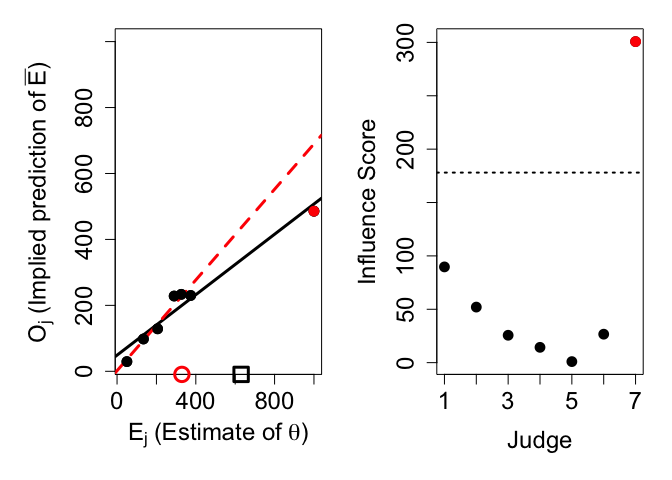

<!-- README.md is generated from README.Rmd. Please edit that file -->

# metaggR

<!-- badges: start -->
<!-- badges: end -->

The goal of `metaggR` is to provide easy access to the
knowledge-weighted estimate proposed in [Palley and Satopää
(2021)](https://papers.ssrn.com/sol3/Papers.cfm?abstract_id=3504286).

## Installation

You can install the released version of `metaggR` from
[CRAN](https://CRAN.R-project.org) with:

``` r
install.packages("metaggR")
```

## Three Gorges Dam Example

This section illustrates `metaggR` on the Three Gorges Dam example in
[Palley and Satopää
(2021)](https://papers.ssrn.com/sol3/Papers.cfm?abstract_id=3504286).

``` r
library(metaggR)
# Judges' estimates:
E1 = c(50, 134, 206, 290, 326, 374)
# Judges' predictions of others:
P1 = c(26, 92, 116, 218, 218, 206)
# Knowledge-weighted estimate:
knowledge_weighted_estimate(E1,P1)
#> [1] 329.305
```

Therefore the final knowledge-weighted estimate is 329.305

Next, we will illustrate the outlier-robust version of the
knowledge-weighted estimate. We augment the simple Three Gorges Dam
example with a 7th judge with an extreme response:

``` r
# Judges' estimates (augmented):
E2 = c(50, 134, 206, 290, 326, 374, 1000)
# Judges' predictions of others (augmented):
P2 = c(26, 92, 116, 218, 218, 206, 400)
# Knowledge-weighted estimate:
knowledge_weighted_estimate(E2,P2)
#> [1] 630.0491
```

The knowledge-weighted estimate is now 630.0491, which is much higher
than the previous 329.305. Clearly this aggregate estimate is driven
largely by the 7th judge. We inspect the crowd for highly influential
judges:

``` r
get_influence_scores(E2,P2, plotIt = TRUE)
```



    #> [1]  89.6910974  52.0441977  25.6565467  14.3443785   0.9792417  26.6575698
    #> [7] 300.7440879

The output prints the influence scores for each judge. Intuitively, an
influence score shows how much the knowledge-weighted estimate would
change if that judge was removed from the crowd. Our analysis shows that
judge 7 is highly influential, with an influence score of around 300.
Compare this to the influence scores of judges 1-6. They are all smaller
than 90 and hence much smaller than judge 7’s influence score.

The function call also produces two plots. The left plot is a scatter
plot of the judges’ estimates against the judges’ implied predictions of
others. This plot includes regression lines both with (solid black) and
without (dashed red) the exceptionally influential judges. All
exceptionally influential judges are shown in red. The
knowledge-weighted estimate is shown both with (black square) and
without (red circle) exceptionally influential judges. The right plot
shows the judges’ influence scores. All exceptionally influential judges
are shown in red. The dashed horizontal line represents the threshold,
defined as the user-defined cutoff value x the interquartile range of
all influence scores.

To remove influential judges’ estimates from the knowledge-weighted
estimate, we calculate the interquartile range (IQR) of the individual
influence scores and remove a judge if that judge’s influence score is
larger than some user-defined cutoff times IQR. Using the default cutoff
of 7/2 on the augmented Three Gorges Dam example gives us the original
knowledge-weighted estimate of 329.305:

``` r
knowledge_weighted_estimate(E2,P2,cutoff=7/2,remove_inf=TRUE)
#> [1] 329.305
```
